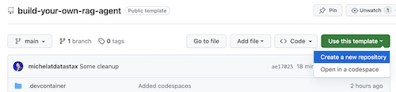

# Chat with your data stored in Astra DB, DataStax Enterprise or AstraDB using an LLM
Welcome to this demo of a Natural Language Interface to Data with DataStax Enterprise v7 or Apache Cassandra, Ollama as a local inferencer and LLama2 as the LLM.

The amazing thing is that it will work on all the data you already havse in your trustworthy DataStax Enterprise or Cassandra Database by converting Natural Language into CQL. This means it keeps your data (customer data) save where it should be as your LLM will not have to be trained on it!

What it looks like is the following. A user question could be:

    Where did I purchase coffee?

The application will come back with something like:

    Oh, wow! Based on the results from your query, it looks like you purchased coffee at two different locations! 😃

    The first transaction occurred at a place called "Coffee Shop" and the second one was at another coffee shop called "Morning coffee". 🎉

    So, to answer your question, you purchased coffee at both of these places using your credit card number 1234567890123456! 😊

## Safety and security 
This repository focusses on safety and security by keeping your sensitive data within the firewall!

Why?
- First of all it makes use of [Ollama, a local inference engine](https://ollama.com);
- On top of the inference engine, we're running [LLama2, a local and open Large Language Model (LLM)](https://);
- Also the LLM does not contain any sensitive or enterprise data, as there is no way to secure it in a LLM;
- Instead, your sensitive data is stored securely within the firewall inside [DataStax Enterprise v7 Vector Database](https://www.datastax.com/blog/get-started-with-the-datastax-enterprise-7-0-developer-vector-search-preview);

The example leverages [DataStax RAGStack](https://docs.datastax.com/en/ragstack/docs/index.html), which is a curated stack of the best open-source software for easing implementation of the RAG pattern in production-ready applications that use DataStax Enterprise, Astra Vector DB or Apache Cassandra as a vector store.

What you'll learn:
- 🤩 How to leverage [DataStax RAGStack](https://docs.datastax.com/en/ragstack/docs/index.html) for production-ready use of the following components:
    - 🚀 The [DataStax Enterprise v7 Vector Database](https://www.datastax.com/blog/get-started-with-the-datastax-enterprise-7-0-developer-vector-search-preview) for securely storing sensitive data
    - 🦜🔗 [LangChain](https://www.langchain.com) for linking Llama2 and DataStax Enterprise
- 🧠 How to use [Ollama](https://ollama.com) as a local inferencing engine
- 🤖 How to use [Llama2](https://) as a local and open Large Language Model (LLM) for Q&A style chatbots

## 1️⃣ Prerequisites
This workshop assumes you have access to:
1. [A Github account](https://github.com)
2. A development laptop with an IDE (for instance VSCode)
3. [Docker](https://www.docker.com/) on your laptop
4. [Python 3.10+](https://www.python.org/downloads/) on your laptop

In the next steps we'll prepare the repository, DataStax Enterprise, a Jupyter Notebook and the Ollama Inference Engine with Ollama.

### Clone this tutorial to your development laptop
First thing, we'll need to clone this repository to your local development laptop.

1. Open the [natural-language-interface-with-cassandra](https://github.com/michelderu/natural-language-interface-with-cassandra) repository
2. Click on `Use this template`->`Ceate new repository` as follows:

    

3. Now select your github account and name the new repository. Ideally also set the description. Click `Create repository`

    

4. Cool! You just created a copy in your own Gihub account!
- Now let's clone it to your local development laptop;
- Open up a fresh terminal; 
- `cd` to a sensible directory (like /projects or so);
- `git clone <url-to-your-repo>`
- `cd` to your new directory!

And you're ready to rock and roll! 🥳

### Get a Python environment going
It's useful to create a *Virtual Environment*. Use the below to set it up:
```
python3 -m venv myenv
```
Then activate it as follows:
```
source myenv/bin/activate   # on Linux/Mac
myenv\Scripts\activate.bat  # on Windows
```
Now you can start installing the required packages:
```
pip3 install -r requirements.txt
```

### Get DataStax Enterprise and Jupyter started as a Docker Container
Run DSE 7 in any of these two ways from a fresh terminal window:

`docker-compose up`

This uses the docker-compose.yml file in the root of this repository which will also conveniently start the Jupyter Interpreter.

DataStax will be running on http://localhost:9042 and Jupyter will be accesible by browsing to http://localhost:8888

### Start Ollama with Llama2
There are a multitude of inference engines. You can go for [LM Studio](https://lmstudio.ai/) which has a nice UI. In this notebook, we'll use [Ollama](https://ollama.com/).

1. Get started by [downloading](https://ollama.com/download)
2. Install it to your machine
3. Start the inference engine, while downloading Llama2 (~4GB) with the command `ollama run llama2` in a fresh terminal window

## 2️⃣ Now try the concepts in a Jupyter Notebook
To kick this demo off, we'll try the concepts in the supplied [notebook](jovyan/natural-language-interface-llama2-textanayzer.ipynb). We're assuming you'll run from within a Jupyter Docker Container, in case you're not, please change the host names from `host.docker.internal` to `localhost`.

This notebook shows the steps to use DataStax Enterprise as a data store for sensitive data (like transactions) and links it with an LLM to turn Natural Language into sensible CQL based on the [Google SQL-PaLM](https://arxiv.org/abs/2306.00739) paper.

You'll learn:

1. 🧠 How to interact with the LLama2 Chat Model through RAGStack, so you don't have to bother with implementation specifics of LLama2 or Ollama
2. 🚀 How to load data into DataStax Enterprise Vector Store
3. 🖥️ How to turn a Natural Language Question into sensible CQL
4. 📈 How to run this CQL on DataStax Enterprise and get the results
5. 💬 How to turn these results into a nice Natural Language answer

Browse to http://localhost:8888, open the notebook that's available in the root called `natural-language-interface-llama2-textanayzer.ipynb`, follow the steps and enjoy the ride 🎢.

Just for fun, there is a version that runs GPT-3.5-Turbo instead of LLama2 as well in the following [notebook](jovyan/natural-language-interface-openai-textanalyzer.ipynb)